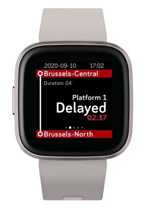

# Traindown

A Fitbit app that counts down until your next train

Fitbit install link: https://gallery.fitbit.com/details/18d42f63-da38-43db-9da3-91685086be41

Demo video: https://twitter.com/iRail/status/1303318682131726342

Currently supported countries:
 - [x] Belgium (NMBS) through [api.iRail.be](https://api.irail.be)
 - [ ] The Netherlands (NS) (planned)
 
Pull Request your own by [coding your own data interface](companion/data/)

This app was heavily inspired by the great [NextTrain app for Pebble](http://nexttrain.tjeerdytsma.nl/).

Planned features:
 - show how crowded your train is.
 - on start-up, choose closest station for from
 - Open issues for feature requests
